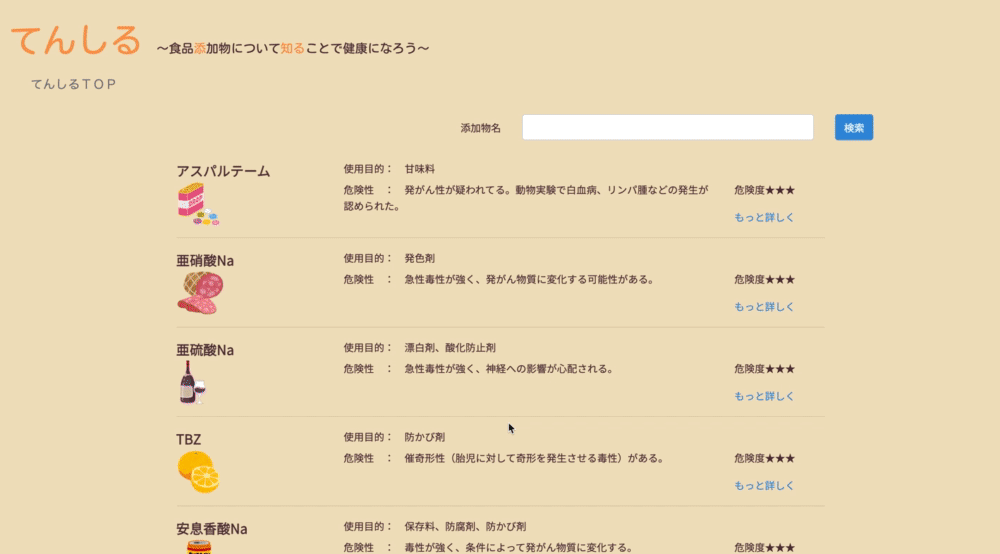

# てんしる　

## システムの概要
本サービスは、よく使用される「添加物名」を一覧で表示し、簡単に調べることが出来ます。  
ユーザー側画面は、レスポンシブウェブデザインとして、PC、スマートフォン両方に対応しています。  
運営者は、管理用CMSで、添加物情報と添加物画像を更新できます。  
PHPと、Laravelを使って開発しています。

## 制作した経緯
私自身、以前から食品添加物について興味を持っており、友人と食品添加物の危険性について話をすることがありました。 
その時に感じたのは、知識が少ないが、本当は健康のために良い商品を選択したいと思っているということでした。

そこで、食品添加物について知ってもらうことで、良い商品を選択できていない人々が多い社会を変えたいという思いで制作しました。

## こだわりポイント
ターゲットは女性のため、柔らかいイメージの色合い、書体にしました。

## 機能一覧、使い方
* ユーザー側 
 
   * 添加物一覧画面表示 
   * 「もっと詳しく」から詳細画面表示 
   * 名前で絞り込み検索機能 

* 運営者側 
Gazo動画 
   * アカウント認証機能 
   * 添加物一覧画面表示 
   * 名前で絞り込み検索機能 
   * 記事、画像投稿機能 
   * 投稿編集機能 
   * 投稿削除機能 

* 閲覧者側、管理者側　共通 
   * ページネーション機能 
   * パンくずリスト表示機能 
　
## URL
* 閲覧者用画面：https://gentle-peak-00140.herokuapp.com/post 
* 管理者用画面：https://gentle-peak-00140.herokuapp.com/admin/post 
   * テストログインボタンを押すことでログインできます。 
   * （メールアドレス：test@example.com　パスワード：test#1234）

## 使用技術
* PHP 7.3 / Composer 
* Laravel 5.8 
* HTML5 / CSS3 
* Bootstrap 4 
* MySQL5.7 
* [開発環境] 
   * AWS EC2 
   * AWS Cloud９ 
   * S3(画像保存) 
* [公開環境] 
   * Heroku 
   * S3（画像保存）

## 参考文献
渡辺雄二 「[最新版]食品添加物　ハンドブック」 ビジネス社, 2020.